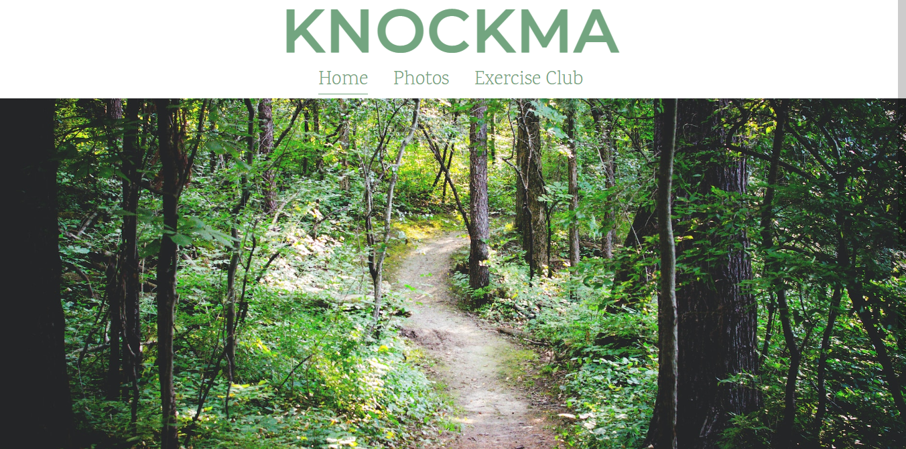
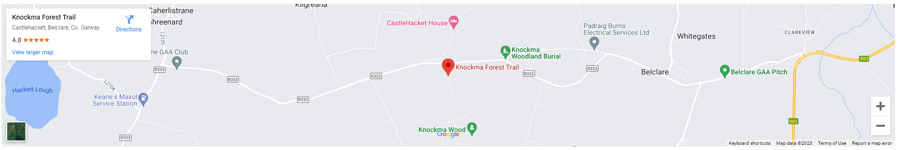
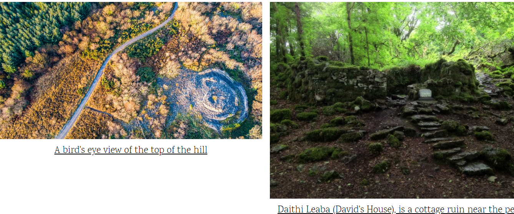
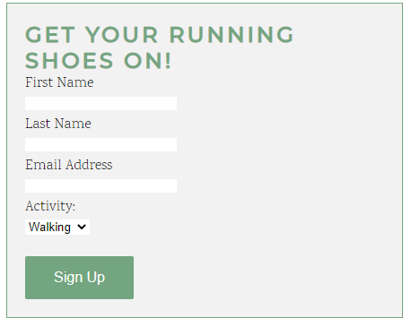

# Knockma Hill

This website aims to educate the user on the location, history and forest trail of Knockma Hill. It includes a photos page which helps to illustrate the natural beauty and intriguing history of Knockma. There is also a signup page which allows the user to sign up to the local walking/running club.

This website hopes to draw tourists and locals alike to Knockma with it's description of the cairns and their supposed mystical aura. 

## Features 

- __Navigation Bar__

  - Featured on all three pages, the full responsive navigation bar includes links to the Home page, Photos and Exercise Club Sign Up page and is identical in each page to allow for easy navigation.
  - This section will allow the user to easily navigate from page to page across all devices without having to revert back to the previous page via the ‘back’ button. 
  - The nav bar is in a green colour which contrasts well with the white background but also hopes to draw a feeling of nature and outdoors.

- __The Home Page image__

  - The home page includes a photograph with of one of the beautiful forest trails.
  - It lets the user exactly what kind of trail it is as soon as they open the page.
  
  

- __Map__

  - The map section allows the user to see exactly where knockma is located, should they wish to visit. 
  - It stretches almost all the way across the screen with just a little padding to let the user know it is all cointained within the page. 

- __The Footer__ 

  - The footer section includes links to the relevant social media sites for Knockma. The links will open to a new tab to allow easy navigation for the user. 
  - The footer is valuable to the user as it encourages them to keep connected via social media.
  - The footer is to be found on each page and is identical on each allowing for continuity throughout the site.

- __Photos__

  - The photos page consists of 6 photos aiming to illustrate the beauty and history contained within and upon Knockma.
  - Each photo has a caption educating the user as to what exactly is in each photo.

- __The Sign Up Page__

  - This page allows the user to sign up to either a walking or running club. 

## Testing

  I tested the website on different screen sizes. A media query for tablet sized screens was unneccessary as each page scaled down and fit as hoped on those screens.

  A media query was necessary for smartphone sized screens as the logo, hero-image, nav bar and photo caption did not size down adequately.

  ### Validator Testing

  - HTML: No errors were returned when passing through the official [W3C validator](https://validator.w3.org/nu/?doc=https%3A%2F%2Fmannio98.github.io%2Fknockma%2F)

  - CSS: No errors were found when passing through the official [(Jigsaw) validator](https://jigsaw.w3.org/css-validator/validator?uri=https%3A%2F%2Fmannio98.github.io%2Fknockma%2F&profile=css3svg&usermedium=all&warning=1&vextwarning=&lang=en)

## Deployment

- The site was deployed to GitHub pages. The steps to deploy are as follows: 
  - In the GitHub repository, navigate to the Settings tab 
  - Selct the Pages option from the mu on the left
  - Then click the save button and a link to your website will be generated 

   The live link can be found here - https://mannio98.github.io/knockma/

## Credit

### Content
  - Parts of the text used on the home page were taken from the following websites https://www.galwaytourism.ie/knockma-hill/ & https://thisisgalway.ie/the-history-of-knockma-hill/

### Media
  - The hero-image was taken from https://unsplash.com/

  - Images from the photos page were taken from the following https://thisisgalway.ie/the-history-of-knockma-hill/, https://www.visitgalway.ie/explore/outdoors-and-recreation/parks-gardens-woodlands/knockma-forest-park/ & https://www.keeptravel.com/ireland/attraction/zamok-hekett

### Code
 - The code for the social media links in the footer was taken from the Love Running project and modified slightly to suit this website.